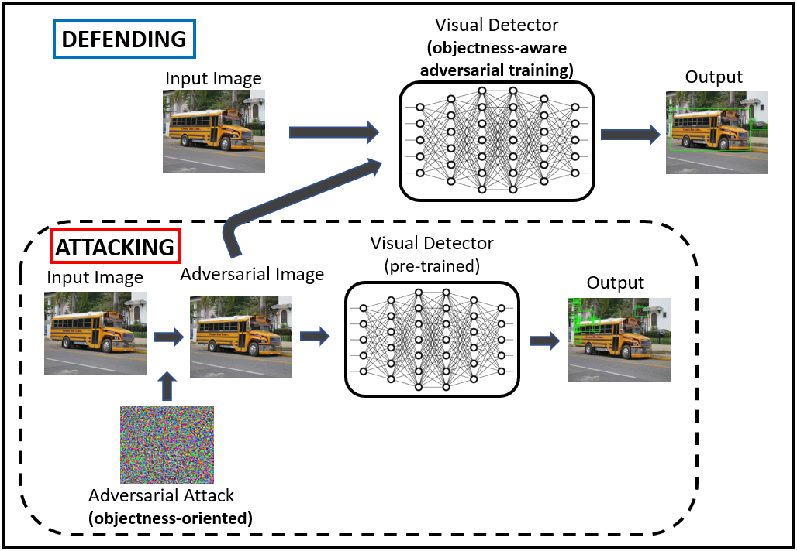
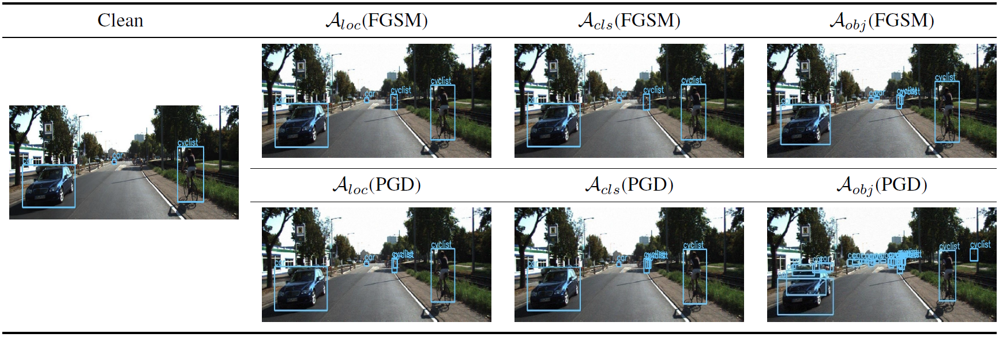
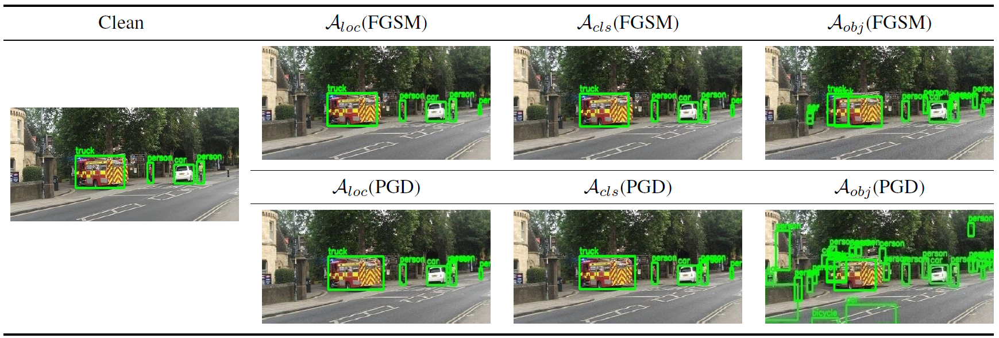

# [Adversarial Attack and Defense of YOLO Detectors in Autonomous Driving Scenarios (IV 2022)](https://arxiv.org/abs/2202.04781)

This repository contains the adversarial attack/defense implementation for the paper:
> Adversarial Attack and Defense of YOLO Detectors in Autonomous Driving Scenarios  
> Jung Im Choi, Qing Tian   
> Bowling Green State University  
> IV 2022

<p align="center">

</p>

                                                            
## Model Training 
**1. Convert your datasets to VOC format for training.**                                                                      
   * Put the label file in the Annotation under the data folder.                                                                   
   * Put the picture file in JPEGImages under the data folder.      
                                                               
**2. Create .txt file by using kitti_annotation.py for training.**                                                                    
   * Create a your_classes.txt under the model_data folder and write the categories you need to classifiy in it.      
   * Modify the class_path in kitti_annotation.py to model_data/your_cls_classes.txt.        
                                                               
**3. Modify the classes_path in adv_training.py and run it to start adversarial training.**                                                              


## Results
                                                               
### 1. Attacks
                                                               
#### a. KITTI                                                               

The table below shows the model performance degradation under various attack strengths for the task-oriented attacks using FGSM and 10-step PGD on KITTI. **A**<sub>*loc*</sub>, **A**<sub>*cls*</sub>, **A**<sub>*loc+cls+conf*</sub>, and **A**<sub>*obj*</sub> denote the attacks sourced from corresponding task losses (i.e., localization, classification, overall, and objectness losses). The objectness-oriented attacks decrease the mAP most. The clean mAP on KITTI is 80.10%.                                                               

| Method | Attack_Size | **A**<sub>*loc*</sub>  |  **A**<sub>*cls*</sub> | **A**<sub>*loc+cls+conf*</sub>  | **A**<sub>*obj*</sub>|
|:-------------------:|:---:|:--------------:|:--------:|:-------------------:|:------------------:|
|FGSM   | ϵ = 2 | -0.98 | -0.97  | -8.42 |  -10.49     |
|FGSM   | ϵ = 4  | -3.20 | -3.15  | -13.88 | -16.85      |
|FGSM   | ϵ = 6 | -6.08 | -5.65  | -17.88 |   -22.59    |
|FGSM   | ϵ = 8  | -10.44 |  -9.65   | -22.04 |  -27.31     |
| PGD-10   | ϵ = 2 | -1.22 |  -0.87 | -42.44 |  -42.64     |
| PGD-10   | ϵ = 4 | -4.11 |  -2.64 | -51.47 |  -51.67     |
| PGD-10   | ϵ = 6 | -7.00 |  -5.91  | -54.17 |  -54.39     |
| PGD-10    | ϵ = 8 | -10.66 | -9.59  | -55.48 |  -55.83     |
                                                               
<p align="center">

</p>                                                               

#### b. COCO_traffic
                                                               
The table below shows the comparison of impact of different task loss-based attacks on model performance (mAP) under various attack sizes using FGSM and PGD-10 on COCO traffic. The clean mAP on COCO traffic is 66.10%.                                                              
                                                               
| Method  | Attack_Size | **A**<sub>*loc*</sub>  |  **A**<sub>*cls*</sub> | **A**<sub>*loc+cls+conf*</sub>  | **A**<sub>*obj*</sub>|          
|:-------------------:|:---:|:--------------:|:--------:|:-------------------:|:------------------:|
|FGSM   | ϵ = 2 | -0.31 | -0.22  | -7.42 |  -7.49     |
|FGSM   | ϵ = 4  | -1.01 | -0.95  | -9.40 | -9.74      |
|FGSM   | ϵ = 6 | -1.85 | -1.86  | -10.54 |   -10.97    |
|FGSM   | ϵ = 8  | -3.30 |  -3.22   | -12.33 |  -12.45     |
| PGD-10   | ϵ = 2 | -0.19 |  -0.15 | -36.55 |  -37.55     |
| PGD-10   | ϵ = 4 | -0.70 |  -0.77 | -43.84 |  -43.93     |
| PGD-10   | ϵ = 6 | -1.88 |  -2.26  | -45.31 |  -45.69     |
| PGD-10    | ϵ = 8 | -3.24 | -3.58  | -46.88 |  -47.08     |           

<p align="center">

</p>
                                                               
### 2. Defense (Adversarial Training)

The tables below show mAP comparison of various adversarially trained YOLO models under PGD-10 attacks on KITTI and COCO traffic validation sets. Depending on which losses the adversarial examples are originated from, the following adversarially trained models are obtained for each dataset: **M**<sub>*STD*</sub> (trained with only clean images), **M**<sub>*ALL*</sub> (adversarially trained using the overall loss), **M**<sub>*MTD*</sub> (trained with the multi-task domain algorithm), **M**<sub>*LOC*</sub>, **M**<sub>*CLS*</sub>, **M**<sub>*OBJ*</sub> (trained with our adversarial examples solely from one kind of three losses), **M**<sub>*OA*</sub> (trained with our objectness-aware AT algorithm).                                                               
                                                               
#### a. KITTI 
                                                               
| Method  |  **A**<sub>*obj*</sub> | **A**<sub>*loc+cls+conf*</sub> | 
|:---------------:|:----------:|:--------------:| 
| **M**<sub>*STD*</sub>  | 28.43 | 28.63 |  
| **M**<sub>*ALL*</sub>  | 39.65 | 40.65 |  
| **M**<sub>*MTD*</sub>  | 36.13 | 35.94 | 
| **M**<sub>*LOC*</sub>  | 37.86 | 37.61 | 
| **M**<sub>*CLS*</sub>  | 39.29 | 39.70 | 
| **M**<sub>*OBJ*</sub>  | **49.43**  | **48.83** |
| **M**<sub>*OA*</sub>   | 42.26  | 41.86 | 
                                                               
#### b. COCO=traffic
                                                               
| Method  |  **A**<sub>*obj*</sub> | **A**<sub>*loc+cls+conf*</sub> |
|:---------------:|:----------:|:--------------:|
| **M**<sub>*STD*</sub>  | 22.17 | 22.29 | 
| **M**<sub>*ALL*</sub>  | 34.58 | 33.44 |  
| **M**<sub>*MTD*</sub>  | 33.26 | 33.20 | 
| **M**<sub>*LOC*</sub>  | 33.23 | 32.10 | 
| **M**<sub>*CLS*</sub>  | 31.71 | 31.58 | 
| **M**<sub>*OBJ*</sub>  | 33.30 | 32.69 | 
| **M**<sub>*OA*</sub>   | **34.77** | **33.61** |                                                                   
                                                               
                                                               
## Citation
If you find it helpful in your research, please consider citeing our paper: 

```
@InProceedings{choi2022advYOLO,
  title = {Adversarial Attack and Defense of YOLO Detectors in Autonomous Driving Scenarios},
  author = {Choi, Jung Im and Tian, Qing},
  booktitle = {2022 IEEE Intelligent Vehicles Symposium (IV)},
  year = {2022},
  pages = {1011-1017},
  doi={10.1109/IV51971.2022.9827222},
}
```

## References
Any pretrained weights and other codes needed for YOLOv4 can be founded on [link](https://github.com/bubbliiiing/yolov4-pytorch).

## Contact
If you have any questions or suggestions, feel free to contact us. (<a>choij@bgsu.edu</a>) 
